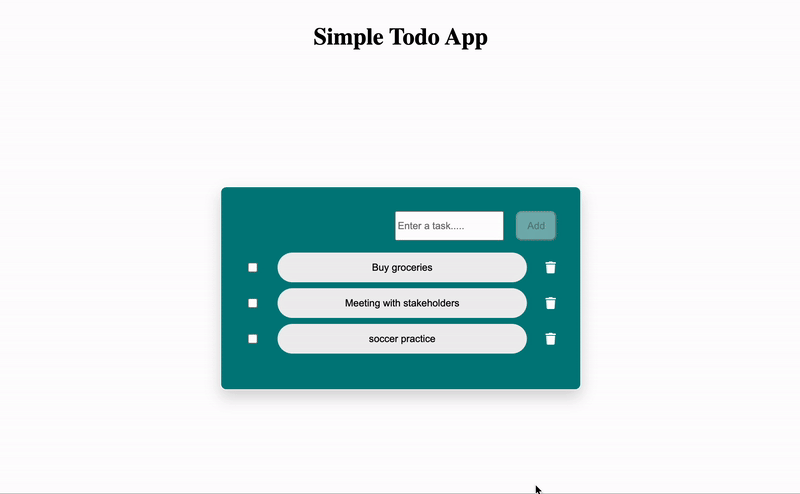

# Simple Todo App

A basic Todo app built using **React + Vite** that allows users to **add, delete, and mark tasks as complete**. 

**Key Features:**
- ✅ Add new tasks
- 🗑️ Delete tasks
- 🎯 Mark tasks as complete
- 💾 Saves tasks in local state (no backend)
- 🎨 **No CSS libraries used** (Material UI, Tailwind, Bootstrap, etc.), except for **React Icons**.

---

**Demo**
    
